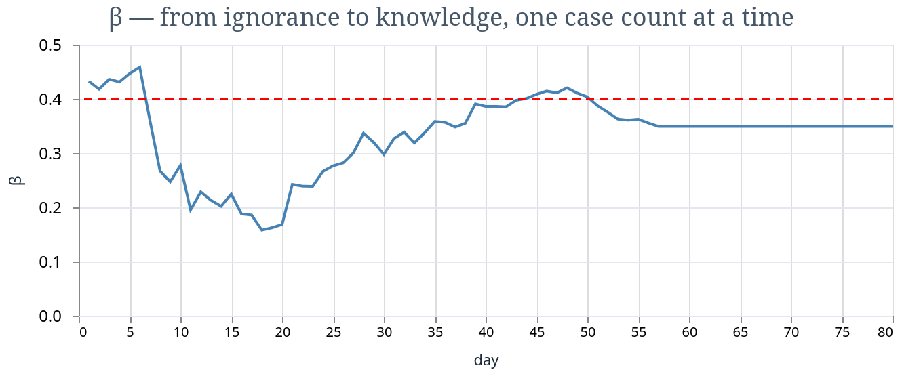

# SMC-Ex

### Translator's Foreword

The algorithms in this library belong to a lineage that begins with Gordon,
Salmond, and Smith's bootstrap filter (1993) and runs through Andrieu, Doucet,
and Holenstein's particle MCMC (2010) to Chopin, Jacob, and Papaspiliopoulos'
SMC² (2013). The online variant that gives this library its centerpiece is due
to Vieira (2018), who observed that evaluating the PMCMC acceptance ratio over
a fixed window of recent observations keeps the cost constant — an insight
whose practical importance for epidemic surveillance was demonstrated by
Temfack and Wyse (2025).

What we have done is translate these methods into Elixir, where the BEAM's
lightweight process model turns the embarrassingly parallel structure of SMC²
into a one-liner: `Task.async_stream` over parameter particles, each running
its own particle filter, supervised, fault-tolerant, and concurrent on as many
cores as the machine provides. Any errors in the translation are the
translator's own.

---

**Sequential Monte Carlo methods for Elixir.**

Particle filters, PMCMC, and Online SMC². Pure Elixir — zero dependencies,
zero NIFs, zero configuration. Install and run.


*Transmission rate β converging to truth (red dashed) as 80 daily case counts arrive. 200 θ-particles, pure Elixir, zero dependencies.*

```elixir
# Track an epidemic in real time — infer β, σ, γ as cases arrive
result = SMC.run(model, prior, daily_cases,
  n_theta: 400, n_x: 200, window: 20, parallel: true)

result.posterior_history  # parameter estimates at each time step
```

## What's Inside

| Module | Algorithm | Source | Use case |
|---|---|---|---|
| `SMC.ParticleFilter` | Bootstrap Particle Filter | Gordon et al. 1993 | State estimation with known parameters |
| `SMC.PMCMC` | Particle Marginal MH | Andrieu et al. 2010 | Parameter inference via MH with PF likelihood |
| `SMC.OnlineSMC2` | Online SMC² | Chopin et al. 2013, Vieira 2018 | Joint online parameter + state inference |

## Installation

```elixir
def deps do
  [{:smc_ex, "~> 0.1"}]
end
```

Zero dependencies. Compiles in seconds.

## Quick Start: Track an Epidemic

```elixir
# 1. Define the state-space model (parameterized by θ)
model = %{
  init: fn theta, rng ->
    {%{s: 999, e: 1, i: 0, r: 0}, rng}
  end,

  transition: fn state, theta, _t, rng ->
    p_se = 1 - :math.exp(-theta.beta * state.i / 1000)
    p_ei = 1 - :math.exp(-theta.sigma)
    p_ir = 1 - :math.exp(-theta.gamma)

    {u1, rng} = :rand.uniform_s(rng)
    y_se = round(max(0, state.s * p_se + (u1 - 0.5) * :math.sqrt(state.s * p_se)))
    y_ei = round(max(0, state.e * p_ei))
    y_ir = round(max(0, state.i * p_ir))

    new = %{s: state.s - y_se, e: state.e + y_se - y_ei,
            i: state.i + y_ei - y_ir, r: state.r + y_ir}
    {new, rng}
  end,

  observation_logp: fn state, theta, y_obs ->
    lambda = max(state.i * theta.sigma, 0.1)
    y_obs * :math.log(lambda) - lambda
  end
}

# 2. Define prior on parameters
prior = %{
  sample: fn rng ->
    {u1, rng} = :rand.uniform_s(rng)
    {u2, rng} = :rand.uniform_s(rng)
    {u3, rng} = :rand.uniform_s(rng)
    {%{beta: u1, sigma: u2 * 0.5, gamma: u3 * 0.3}, rng}
  end,
  logpdf: fn theta ->
    if theta.beta > 0 and theta.sigma > 0 and theta.gamma > 0,
      do: 0.0, else: -1.0e30
  end
}

# 3. Run — observations arrive sequentially
result = SMC.run(model, prior, daily_cases,
  n_theta: 200,    # parameter particles
  n_x: 100,        # state particles per θ
  window: 20,      # O-SMC² window size
  n_moves: 3,      # PMCMC moves per rejuvenation
  parallel: true    # use all cores
)

# 4. Results
result.posterior_history  # [{%{beta: 0.38, sigma: 0.24, gamma: 0.16}, ...}, ...]
result.ess_history        # [200.0, 195.3, ..., 48.7, ...]  (drops trigger rejuv)
result.log_evidence       # -342.7 (model evidence for comparison)
result.rejuvenation_count # 5 (how many times PMCMC ran)
```

## Particle Filter Only (Known Parameters)

When θ is known and you just need to track latent states:

```elixir
model = %{
  init: fn rng -> {%{x: 0.0}, rng} end,
  transition: fn state, t, rng ->
    {noise, rng} = :rand.normal_s(rng)
    {%{x: state.x + noise}, rng}
  end,
  observation_logp: fn state, y_t ->
    z = (y_t - state.x) / 0.5
    -0.5 * z * z
  end
}

result = SMC.filter(model, observations, n_particles: 500)

result.filtering_means  # weighted mean state at each time step
result.log_evidence     # log marginal likelihood
result.ess_history      # particle filter ESS
```

## The BEAM Advantage

O-SMC² has two embarrassingly parallel loops:

1. **BPF step** for each θ-particle — propagate states, weight by likelihood
2. **PMCMC rejuvenation** — propose new θ, evaluate windowed likelihood

On the BEAM, both are `Task.async_stream`:

```elixir
theta_particles
|> Task.async_stream(&bpf_step/1, max_concurrency: System.schedulers_online())
```

**Fault tolerance for free**: if one particle's filter crashes (numerical
degeneracy, extreme parameter proposal), the `Task` catches the `:exit` — all
other particles continue unaffected. This is fault-tolerant particle filtering
by construction. In Python, one particle crashing kills the entire run.

**Scaling**: On an 88-core server, 400 θ-particles run in ~5 waves (400/88).
Each wave processes one observation's worth of BPF steps in parallel.

## Options

### SMC.run (O-SMC²)

| Option | Default | Description |
|---|---|---|
| `n_theta` | 200 | Parameter particles |
| `n_x` | 100 | State particles per θ-particle |
| `window` | 20 | Window size for O-SMC² (tk). Larger = more accurate, slower |
| `resample_threshold` | 0.5 | ESS fraction triggering rejuvenation |
| `n_moves` | 3 | PMCMC moves per rejuvenation |
| `proposal_scale` | 2.0 | Scale factor for Normal proposal covariance |
| `parallel` | true | Use `Task.async_stream` |
| `seed` | 42 | Random seed |

### SMC.filter (Particle Filter)

| Option | Default | Description |
|---|---|---|
| `n_particles` | 200 | Number of particles |
| `resample_threshold` | 0.5 | ESS fraction triggering resampling |
| `seed` | 42 | Random seed |

## Model Specification

### For O-SMC² (parameters unknown)

```elixir
model = %{
  init: fn(theta, rng) -> {initial_state, rng},
  transition: fn(state, theta, t, rng) -> {new_state, rng},
  observation_logp: fn(state, theta, y_t) -> log_likelihood
}

prior = %{
  sample: fn(rng) -> {theta_map, rng},
  logpdf: fn(theta) -> log_prior_density
}
```

### For Particle Filter (parameters known)

```elixir
model = %{
  init: fn(rng) -> {initial_state, rng},
  transition: fn(state, t, rng) -> {new_state, rng},
  observation_logp: fn(state, y_t) -> log_likelihood
}
```

States and parameters are plain Elixir maps. No tensors, no special types.

## When to Use What

| Your situation | Method | Library |
|---|---|---|
| Known parametric model, continuous parameters | NUTS / HMC | eXMC, Stan, PyMC |
| Unknown functional form, many features | BART | StochTree-Ex |
| **Discrete state transitions, unknown parameters, streaming** | **O-SMC²** | **smc_ex** |
| Known parameters, tracking latent states | Particle filter | smc_ex |
| Epidemic surveillance in real time | O-SMC² | smc_ex |
| Hidden Markov Models | Particle filter + EM or O-SMC² | smc_ex |

## Notebooks

- `notebooks/01_epidemic_tracking.livemd` — Full SEIR epidemic tracking with
  O-SMC², synthetic data, VegaLite charts

## Architecture

```
SMC.run(model, prior, observations)
  │
  ├── Initialize Nθ parameter particles from prior
  │
  └── For each observation y_t:
      │
      ├── For each θ-particle (parallel):
      │   └── SMC.ParticleFilter: one BPF step
      │       → incremental likelihood p̂(y_t | θ)
      │
      ├── Reweight θ-particles
      │
      └── If ESS < threshold:
          ├── Resample θ-particles
          └── For each θ-particle (parallel):
              └── SMC.PMCMC: M Metropolis-Hastings moves
                  └── SMC.ParticleFilter.filter_window
                      (only last tk observations — constant cost)
```

## References

- Gordon, N., Salmond, D. & Smith, A. (1993). "Novel approach to nonlinear/
  non-Gaussian Bayesian state estimation." *IEE Proceedings F*.
- Andrieu, C., Doucet, A. & Holenstein, R. (2010). "Particle Markov chain
  Monte Carlo methods." *JRSS-B*, 72, 1-269.
- Chopin, N., Jacob, P.E. & Papaspiliopoulos, O. (2013). "SMC²: An efficient
  algorithm for sequential analysis of state space models." *JRSS-B*, 75, 397-426.
- Vieira, R.M. (2018). *Bayesian Online State and Parameter Estimation for
  Streaming Data*. PhD thesis, Newcastle University.
- Temfack, D. & Wyse, J. (2025). "Sequential Monte Carlo Squared for online
  inference in stochastic epidemic models." *Epidemics* 52, 100847.


## The Ecosystem: Les Trois Chambrées

_Probabiliers de tous les a priori, unissez-vous!_

smc_ex is one of three standalone Elixir libraries for Bayesian inference.
Different algorithms, different use cases, zero shared dependencies.

| Library | Algorithm | For |
|---|---|---|
| [**eXMC**](https://github.com/borodark/eXMC) | NUTS / HMC | Known parametric models, continuous parameters |
| **smc_ex** | Bootstrap PF, PMCMC, Online SMC² | Discrete states, streaming data, epidemic tracking |
| [**StochTree-Ex**](https://github.com/borodark/stochtree_ex) | BART | Unknown functional form, feature discovery |

They compose in the same application — each is a Mix dependency:

```elixir
def deps do
  [
    {:exmc, "~> 0.2"},            # NUTS for continuous models
    {:smc_ex, "~> 0.1"},          # O-SMC² for discrete state-space
    {:stochtree_ex, "~> 0.1"},    # BART for nonparametric regression
  ]
end
```

## License

Apache-2.0
